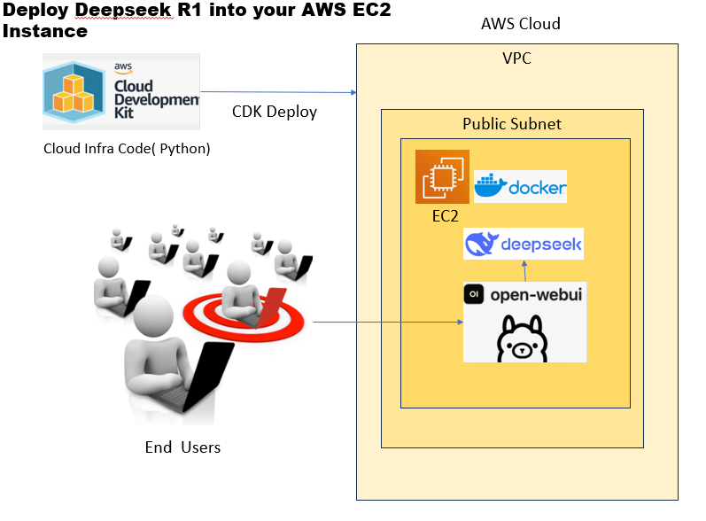
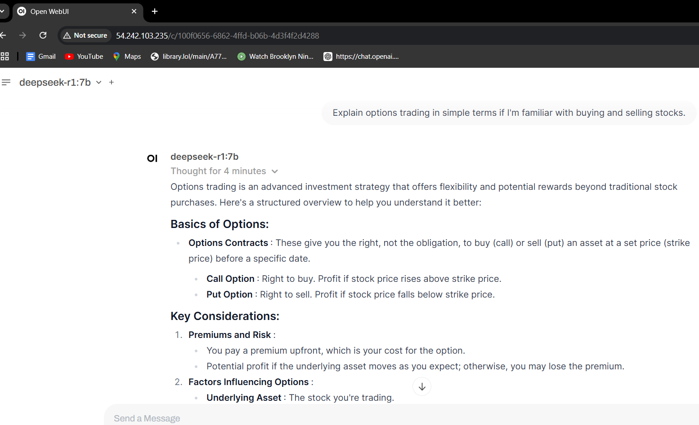

# Deepseek Infrastructure Pipeline - AWS CDK


## Addressing Enterprise Security Concerns with Private GenAI Deployments
Many enterprises are hesitant to fully embrace Generative AI models like ChatGPT for widespread employee use due to legitimate security and data privacy concerns. These concerns often include:

* **Data Leakage:** Sensitive company data could inadvertently be exposed when employees input prompts into public AI services.
* **Compliance Risks:** Sharing data with external AI providers might violate industry-specific regulations or internal data governance policies.
* **Lack of Control:** Enterprises have limited control over how their data is used and stored by third-party AI providers.

To overcome these hurdles, this solution deployes open-source AI models within a company's own AWS environment. This approach offers several key advantages:

*  **Private Network Deployment:** By using AWS CDK (Cloud Development Kit) in Python, your code automates the deployment of Deepseek, Llama, and potentially other models within a private subnet of an AWS Virtual Private Cloud (VPC). This ensures that all AI processing and data storage remain within the enterprise's control.

* **Secure Access via Reverse Proxy:** A reverse proxy (Nginx) running in a public subnet acts as a secure gateway for employees to access the AI models. This architecture prevents direct exposure of the AI models to the public internet, enhancing security.

* **Containerization with Docker:** Docker is used to containerize the AI models and related components, which enables consistent and reproducible deployments across different environments.

* **User-Friendly Interface with Open WebUI:** The integration of Open WebUI provides a user-friendly web interface for employees to interact with the AI models, making it easier to adopt and use.

* **GPU Acceleration Option:** The solution provides the flexibility to deploy the AI models on GPU-powered EC2 instances for faster processing or on CPU-based instances, depending on the specific performance and cost requirements.

* **Automated NVIDIA Driver Installation:** For GPU-enabled deployments, your code automates the installation of the necessary NVIDIA drivers, simplifying the setup process.

* **Data Sovereignty:** All data used to prompt or fine-tune the models remains within the company's private network, addressing data sovereignty and compliance concerns.

* **Model Fine-Tuning:** Companies can further leverage the solution by fine-tuning the deployed models with their own proprietary data, tailoring them to specific business needs and improving their accuracy on internal tasks.

## AI Models Overview
Llama is a family of large language models (LLMs) released by Meta AI starting in February 2023.
DeepSeek is the name of a free AI-powered chatbot, which looks, feels and works very much like ChatGPT.It is reportedly as powerful as OpenAI's o1 model - released at the end of last year - in tasks including mathematics and coding.

[DeepSeek](https://www.deepseek.com/) R1 is a large language model developed with a strong focus on reasoning tasks. It excels at problems requiring multi-step analysis and logical thinking. Unlike typical models that rely heavily on Supervised Fine-Tuning (SFT), DeepSeek R1 uses Reinforcement Learning (RL) as its primary training strategy. This emphasis on RL empowers it to figure out solutions with greater independence. <br> <br>


This project provisions a scalable and secure AI infrastructure for deploying the llama and DeepSeek AI models using **AWS CDK (Cloud Development Kit)** with Python. The architecture leverages **Amazon VPC, EC2 Instances, IAM Roles, Security Groups, ollama, docker and open WebUI** integration to provide a robust environment for AI model training and inference. 
<br>




Okay, here's a breakdown of the image you sent, which illustrates the deployment of Deepseek R1 into an AWS EC2 instance:

**Overall Architecture**

The Architecture diagram  illustrates a typical deployment architecture in AWS where the Deepseek R1 model is deployed in a private subnet for security, while a reverse proxy in the public subnet handles external requests and routes them to the Deepseek R1 application. The AWS CDK is used to automate and manage the deployment process.It also outlines how end-users interact with the Deepseek R1 model, which runs within an AWS environment.

**Key Components and Flow**

1.  **End Users:**  Represented by figures, they are the users who will be accessing and interacting with the Deepseek R1 application.

2.  **AWS Cloud Development Kit (CDK):** The AWS CDK is used to define and deploy the cloud infrastructure.  The infrastructure is defined as code (in Python, as indicated).  This allows for repeatable and version-controlled deployments.

3.  **VPC (Virtual Private Cloud):** The AWS VPC provides a logically isolated section of the AWS Cloud where the resources are launched, providing control over the virtual networking environment.  It contains a Public Subnet and a Private Subnet.

4.  **Public Subnet:**
    *   **EC2 Instance:** An EC2 (Elastic Compute Cloud) instance is launched within the public subnet. This EC2 instance hosts a reverse proxy.
    *   **Nginx (Reverse Proxy):** Nginx acts as a reverse proxy.  It receives requests from the end-users and forwards them to the appropriate server in the private subnet.

5.  **Private Subnet:**
    *   **EC2 Instance:** Another EC2 instance resides within the private subnet. This instance hosts the core components of the Deepseek R1 deployment.
    *   **Docker:** Docker is used to containerize the AI Models, Open WebUI
    *   **Deepseek:** This represents the Deepseek R1 model, running inside a Docker container.
    *   **Open-WebUI:** This provides a web interface for interacting with the Deepseek model.


## Prerequisites:
- Active AWS account with appropriate permissions to launch EC2 instances and manage related resources.
- Service Quota limit for approved for Running On-Demand Inf instances under Amazon Elastic Compute Cloud (Amazon EC2) with a value of 96 or above.
- A Key Pair created to connect with EC2 instance.
- **AWS CDK** installed (`npm install -g aws-cdk`)
- **AWS CLI** configured (`aws configure`)
- **Python** (>= 3.8)
- **AWS account with required permissions**


## Features

- **VPC Configuration:**
  - Public and private subnets.
  - NAT gateway for outbound internet access.
  - S3 VPC Endpoint for efficient data transfer.
- **Security Group:**
  - SSH (Port 22) access.
  - AI model serving ports (3000, 11434, etc.).
- **IAM Role & Instance Profile:**
  - EC2 assumes IAM Role with **AmazonS3ReadOnlyAccess**.
- **EC2 Instance Configuration:**
  - Uses an **r5a.2xlarge** instance type.
  - Boots with Amazon Linux 2 AMI.
  - Installs Docker and deploys AI models (Ollama, Open-WebUI).
  - Uses key pair authentication.

## Deploying to CPU based EC2 instance 

To deploy CPU based EC2 instance ,change below parameter in config file(configs/account.py)

   ```bash
      ## CI/CD managed Accounts
      managed_accounts = {
         "dev": {
            "enabled": True,
            "deployment_type" : "gpu",  # Change this parameter to cpu if you want deploy cpu powered EC2 
   ```

Below commands creates and configures three Ollama docker containers:

1. **ollama-llama3**: Runs the Ollama model with name `ollama/ollama`, exposes port 11434, and pulls the latest version of the `llama3.2` model.
2. **ollama-deepseek**: Runs the Ollama model with name `ollama/ollama`, exposes port 11435, and pulls the latest version of the `deepseek-r1:7b` model.
3. **open-webui**: Runs a Docker container for the Open WebUI, exposing port 3000, and mounts a volume from `/app/backend/data`. The container is configured to use the URLs of both Ollama containers as base URLs.

The file also sets up the environment for running Docker on Amazon Linux, creates a network for the containers, and enables automatic restarting of the Open WebUI container.

   ```bash
               user_data.add_commands(
                "sudo yum update -y",
                "sudo amazon-linux-extras enable docker",
                "sudo yum install -y docker",
                "sudo systemctl start docker",
                "sudo systemctl enable docker",
                "sudo usermod -aG docker ec2-user",
                # Create an Ollama containers,Pull the models in their respective containers,Create the Open WebUI container to serve as the front-end:
                "docker network create ai-network",
                "docker run -d --network ai-network --name ollama-llama3 -v ollama-llama3:/root/.ollama -p 11434:11434 ollama/ollama",
                "docker run -d  --network ai-network --name ollama-deepseek -v ollama-deepseek:/root/.ollama -p 11435:11434 ollama/ollama",
                "docker exec  ollama-llama3 ollama pull llama3.2",
                "docker exec  ollama-deepseek ollama pull deepseek-r1:7b",
                "docker run -d --network ai-network  -p 3000:8080 -e OLLAMA_BASE_URLS='http://ollama-llama3:11434;http://ollama-deepseek:11434' -v open-webui:/app/backend/data --name open-webui --restart always ghcr.io/open-webui/open-webui:main",
                "docker exec  ollama-llama3 ollama pull llama3.2",
                "docker exec  ollama-deepseek ollama pull deepseek-r1:7b",
                # docker exec -it ollama_2 ollama pull llama3.2
            )
   ```
## Deploying to GPU-powered EC2 instance instance 

### Install and configure NVIDIA drivers on EC2 Instance
By default this code deployes GPU-powered EC2 instance type **g4dn.xlarge**. 

When you create an EC2 instance using CDK, you can provide a UserData value that will be executed as a shell command on the instance. This allows you to install software, configure the network, and perform other setup tasks before the instance becomes available for use.


**User Data Script**

The script performs the following tasks on an EC2 instance:

1. Installs necessary packages, including GCC and kernel-devel.
2. Downloads and installs NVIDIA drivers.
3. Configures Docker to run as a non-root user.
4. Enables the Docker service to start automatically on boot.

**Container Creation**

The script creates three containers:

1. **ollama-llama3**: Runs an Ollama model with name `ollama/ollama`, exposes port 11434, and pulls the latest version of the `llama3.2` model.
2. **ollama-deepseek**: Runs an Ollama model with name `ollama/ollama`, exposes port 11435, and pulls the latest version of the `deepseek-r1:7b` model.
3. **open-webui**: Runs a Docker container for the Open WebUI, exposing port 3000, and mounts a volume from `/app/backend/data`. The container is configured to use the URLs of both Ollama containers as base URLs.

The script also creates an NVIDIA container toolkit repository and installs it on the instance.

   ```bash
            user_data.add_commands(
                "sudo yum install -y gcc kernel-devel-$(uname -r)",
                "aws s3 cp --recursive s3://ec2-linux-nvidia-drivers/latest/ .",
                "sudo chmod +x ./NVIDIA-Linux-x86_64*.run",
                "sudo /bin/sh ./NVIDIA-Linux-x86_64*.run --tmpdir . --silent",
                "sudo touch /etc/modprobe.d/nvidia.conf",
                f'echo "options nvidia NVreg_EnableGpuFirmware=0" | sudo tee --append /etc/modprobe.d/nvidia.conf',
                "sudo yum install -y docker",
                "sudo usermod -a -G docker ec2-user",
                "sudo systemctl enable docker.service",
                "sudo systemctl start docker.service",
                "curl -s -L https://nvidia.github.io/libnvidia-container/stable/rpm/nvidia-container-toolkit.repo | sudo tee /etc/yum.repos.d/nvidia-container-toolkit.repo",
                "sudo yum install -y nvidia-container-toolkit",
                "sudo nvidia-ctk runtime configure --runtime=docker",
                "sudo systemctl restart docker",
                # Create an Ollama containers,Pull the models in their respective containers,Create the Open WebUI container to serve as the front-end:
                "docker network create ai-network",
                "docker run -d --gpus=all --network ai-network --name ollama-llama3 -v ollama-llama3:/root/.ollama -p 11434:11434 ollama/ollama",
                "docker run -d --gpus=all  --network ai-network --name ollama-deepseek -v ollama-deepseek:/root/.ollama -p 11435:11434 ollama/ollama",
                "sleep 20",
                "docker exec  ollama-llama3 ollama pull llama3.2",
                "docker exec  ollama-deepseek ollama pull deepseek-r1:7b",
                "docker run -d --gpus=all --network ai-network  -p 3000:8080 -e OLLAMA_BASE_URLS='http://ollama-llama3:11434;http://ollama-deepseek:11434' -v open-webui:/app/backend/data --name open-webui --restart always ghcr.io/open-webui/open-webui:main",
            )
   ```

## Deployment Steps

## Setup

1. Clone this repository:
   ```bash
   git clone https://github.com/bpeddi/deepseek_aws_demo.git
   cd deepseek_aws_demo/cdkai_deploy
   ```

2. **Create and activate a virtual environment:**
   ```sh
   python3 -m venv .venv
   source .venv/bin/activate   # Mac/Linux
   .venv\Scripts\activate      # Windows
   ```
3. **Install dependencies:**
   ```sh
   pip install -r requirements.txt
   ```
4. **Bootstrap CDK (if first-time deployment):**
   ```sh
   cdk bootstrap
   ```
5. **Deploy the stack:**
   ```sh
    cdk deploy dev-ai-pipeline  --require-approval never
   ```


## Cleanup

To remove the resources provisioned:

```sh
cdk destroy dev-ai-pipeline
```
## Final output

Once you deploy the solution, you should be able to access models by opening public ip
`http://<public Ip>`



## Configuration

Modify the `conigs/accounts.py` or update `AIInfraPipeline` class parameters to customize the deployment.

## Troubleshooting

- Ensure AWS credentials are correctly configured.
- Check **CloudFormation** stack logs for deployment errors.
- Verify security group rules if access issues arise.

## Conclusion
your CDK-based deployment solution offers a robust and secure way for enterprises to unlock the power of Generative AI while mitigating the security and compliance risks associated with public AI services. By deploying models like Deepseek and Llama within their own private networks, companies can empower their employees with AI-driven capabilities while maintaining full control over their sensitive data.

## Author

[Bala Peddi]\
[bala.peddi@gmail.com]
