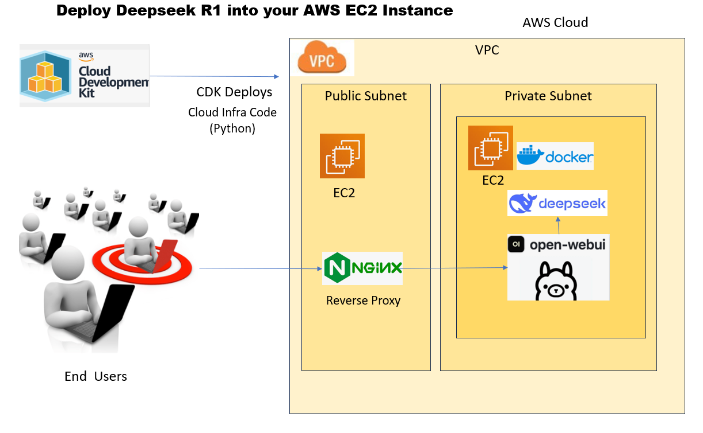

# Deepseek Infrastructure Pipeline - AWS CDK

## Overview

[DeepSeek](https://www.deepseek.com/) R1 is a large language model developed with a strong focus on reasoning tasks. It excels at problems requiring multi-step analysis and logical thinking. Unlike typical models that rely heavily on Supervised Fine-Tuning (SFT), DeepSeek R1 uses Reinforcement Learning (RL) as its primary training strategy. This emphasis on RL empowers it to figure out solutions with greater independence. <br> <br>


This project provisions a scalable and secure AI infrastructure for deploying the DeepSeek AI model using **AWS CDK (Cloud Development Kit)** with Python. The architecture leverages **Amazon VPC, EC2 Instances, IAM Roles, Security Groups, and S3 Bucket** integration to provide a robust environment for AI model training and inference. 
<br>




Okay, here's a breakdown of the image you sent, which illustrates the deployment of Deepseek R1 into an AWS EC2 instance:

**Overall Architecture**

The Architecture diagram  illustrates a typical deployment architecture in AWS where the Deepseek R1 model is deployed in a private subnet for security, while a reverse proxy in the public subnet handles external requests and routes them to the Deepseek R1 application. The AWS CDK is used to automate and manage the deployment process.It also outlines how end-users interact with the Deepseek R1 model, which runs within an AWS environment.

**Key Components and Flow**

1.  **End Users:**  Represented by figures, they are the users who will be accessing and interacting with the Deepseek R1 application.

2.  **AWS Cloud Development Kit (CDK):** The AWS CDK is used to define and deploy the cloud infrastructure.  The infrastructure is defined as code (in Python, as indicated).  This allows for repeatable and version-controlled deployments.

3.  **VPC (Virtual Private Cloud):** The AWS VPC provides a logically isolated section of the AWS Cloud where the resources are launched, providing control over the virtual networking environment.  It contains a Public Subnet and a Private Subnet.

4.  **Public Subnet:**
    *   **EC2 Instance:** An EC2 (Elastic Compute Cloud) instance is launched within the public subnet. This EC2 instance hosts a reverse proxy.
    *   **Nginx (Reverse Proxy):** Nginx acts as a reverse proxy.  It receives requests from the end-users and forwards them to the appropriate server in the private subnet.

5.  **Private Subnet:**
    *   **EC2 Instance:** Another EC2 instance resides within the private subnet. This instance hosts the core components of the Deepseek R1 deployment.
    *   **Docker:** Docker is used to containerize the AI Models, Open WebUI
    *   **Deepseek:** This represents the Deepseek R1 model, running inside a Docker container.
    *   **Open-WebUI:** This provides a web interface for interacting with the Deepseek model.

**In Summary**


## Prerequisites:
- Active AWS account with appropriate permissions to launch EC2 instances and manage related resources.
- Service Quota limit for approved for Running On-Demand Inf instances under Amazon Elastic Compute Cloud (Amazon EC2) with a value of 96 or above.
- A Key Pair created to connect with EC2 instance.
- **AWS CDK** installed (`npm install -g aws-cdk`)
- **AWS CLI** configured (`aws configure`)
- **Python** (>= 3.8)
- **AWS account with required permissions**


## Features

- **VPC Configuration:**
  - Public and private subnets.
  - NAT gateway for outbound internet access.
  - S3 VPC Endpoint for efficient data transfer.
- **Security Group:**
  - SSH (Port 22) access.
  - AI model serving ports (3000, 11434, etc.).
- **IAM Role & Instance Profile:**
  - EC2 assumes IAM Role with **AmazonS3ReadOnlyAccess**.
- **EC2 Instance Configuration:**
  - Uses an **r5a.2xlarge** instance type.
  - Boots with Amazon Linux 2 AMI.
  - Installs Docker and deploys AI models (Ollama, Open-WebUI).
  - Uses key pair authentication.

## Deploying to CPU based EC2 instance 

No changes required ,This code works as is

## Deploying to GPU-powered EC2 instance instance 

### Install and configure NVIDIA drivers on EC2 Instance
If you are planning to use GPU-powered EC2 instance, you will have to change InstanceType below line to g4dn.xlarge in cdkai_deploy/ai_deploy.py
```instance_type=ec2.InstanceType("r5a.2xlarge"),  # Define instance type```

Login to EC2 instance and Run the following commands in the to install the NVIDIA GRID drivers on the g4dn EC2 instance.

```sudo yum update -y
sudo yum install gcc makesudo yum install -y gcc kernel-devel-$(uname -r)
cd ~
aws s3 cp --recursive s3://ec2-linux-nvidia-drivers/latest/ .
chmod +x NVIDIA-Linux-x86_64*.run
mkdir /home/ssm-user/tmp
chmod -R 777 tmp
cd /home/ssm-user 
export TMPDIR=/home/ssm-user/tmp
CC=/usr/bin/gcc10-cc ./NVIDIA-Linux-x86_64*.run --tmpdir=$TMPDIR
nvidia-smi -q | head
sudo touch /etc/modprobe.d/nvidia.conf
echo "options nvidia NVreg_EnableGpuFirmware=0" | sudo tee --append /etc/modprobe.d/nvidia.conf
```


## Deployment Steps

## Setup

1. Clone this repository:
   ```bash
   git clone https://github.com/bpeddi/deepseek_aws_demo.git
   cd deepseek_aws_demo/cdkai_deploy
   ```

2. **Create and activate a virtual environment:**
   ```sh
   python3 -m venv .venv
   source .venv/bin/activate   # Mac/Linux
   .venv\Scripts\activate      # Windows
   ```
3. **Install dependencies:**
   ```sh
   pip install -r requirements.txt
   ```
4. **Bootstrap CDK (if first-time deployment):**
   ```sh
   cdk bootstrap
   ```
5. **Deploy the stack:**
   ```sh
    cdk deploy dev-ai-pipeline  --require-approval never
   ```


## Cleanup

To remove the resources provisioned:

```sh
cdk destroy
```
## Final output

Once you deploy the solution, you should be able to access models by opening public ip
`http://<public Ip>`


## Configuration

Modify the `conigs/accounts.py` or update `AIInfraPipeline` class parameters to customize the deployment.

## Troubleshooting

- Ensure AWS credentials are correctly configured.
- Check **CloudFormation** stack logs for deployment errors.
- Verify security group rules if access issues arise.

## Author

[Bala Peddi]\
[bala.peddi@gmail.com]
